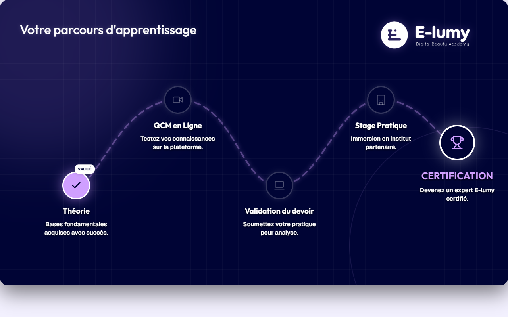

# Parcours d'Apprentissage — Slide Final Partagé (FR)

**Course:** Brow lift & Lamination · Soin de visage · Basic Facial · Massage Berbere · Kobido · Soin HydraFacial · Combinaison LASH+BROW · LASH LIFTING · Massage Relaxant · Reconstruction du Sourcil · Maquillage Correctif  
**Slide:** Final slide (shared)  
**Live URL:** https://learning-path.edtechiecorp.com  
**Stack:** Next.js · Tailwind CSS · TypeScript · GitHub Pages  

## What this slide does

Shared course completion slide displayed at the end of multiple French-language courses. Shows the learner their completed learning path and highlights the next courses they can explore. This congratulatory slide reinforces the learner's progress and encourages continued engagement with the EdTechie curriculum by showing what other certifications are available.

## Screenshot

## Usage

This slide is embedded as an iframe inside Coassemble at the live URL above. DNS is managed via Cloudflare (`edtechiecorp.com`). To update the slide, push to the `main` branch — GitHub Actions will rebuild and redeploy automatically.
